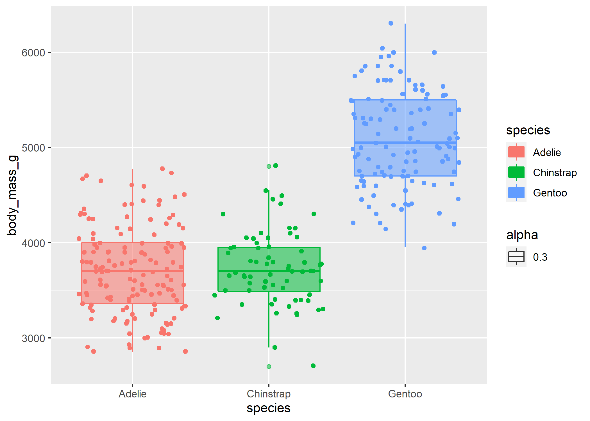

penguins
================

## Data

This dataset is composed of morphometric and demographic measurements of
a variety of penguin species in Antarctica compiled by Dr. Kristen
Gorman and the Palmer Station.


``` r
head(penguins)
```

    ## # A tibble: 6 x 8
    ##   species island bill_length_mm bill_depth_mm flipper_length_~ body_mass_g sex  
    ##   <fct>   <fct>           <dbl>         <dbl>            <int>       <int> <fct>
    ## 1 Adelie  Torge~           39.1          18.7              181        3750 male 
    ## 2 Adelie  Torge~           39.5          17.4              186        3800 fema~
    ## 3 Adelie  Torge~           40.3          18                195        3250 fema~
    ## 4 Adelie  Torge~           NA            NA                 NA          NA <NA> 
    ## 5 Adelie  Torge~           36.7          19.3              193        3450 fema~
    ## 6 Adelie  Torge~           39.3          20.6              190        3650 male 
    ## # ... with 1 more variable: year <int>

<br>

## Single trait distribution

Let’s look at the trait distribution for body mass by species!

``` r
ggplot(penguins, aes(color = species, y = body_mass_g, x = species)) +
  geom_boxplot(aes(fill = species, alpha = 0.3)) +
  geom_jitter()  
```

<!-- -->
Seems like Gentoo penguins have the highest mass on average of all three
penguin species.

<br>

## Relationship between multiple traits

Let’s look at the relationship between body mass and flipper length
among penguins, separated by species?

``` r
ggplot(penguins, aes(color = species, x = body_mass_g, y = flipper_length_mm)) +
  geom_point(shape = 1) +
  geom_smooth(method = 'lm')
```

    ## `geom_smooth()` using formula 'y ~ x'

<!-- --> <br>

## Sexual Dimorphism

``` r
penguins <- na.omit(penguins)
ggplot(penguins, aes(color = sex, x = sex, y = body_mass_g)) +
 geom_boxplot(aes(fill = sex, alpha = 0.3)) +
  geom_jitter(width = 0.5) +
  facet_wrap(~species) +
  geom_signif(comparisons = list(c("female","male")), map_signif_level = TRUE, color = "black")
```

<!-- -->
